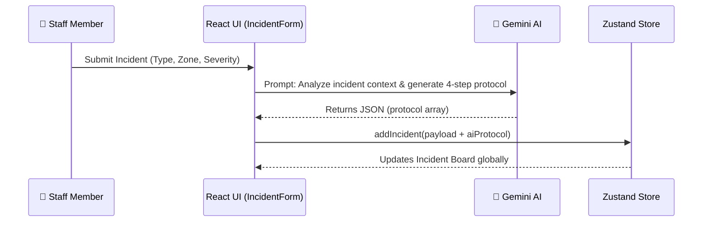
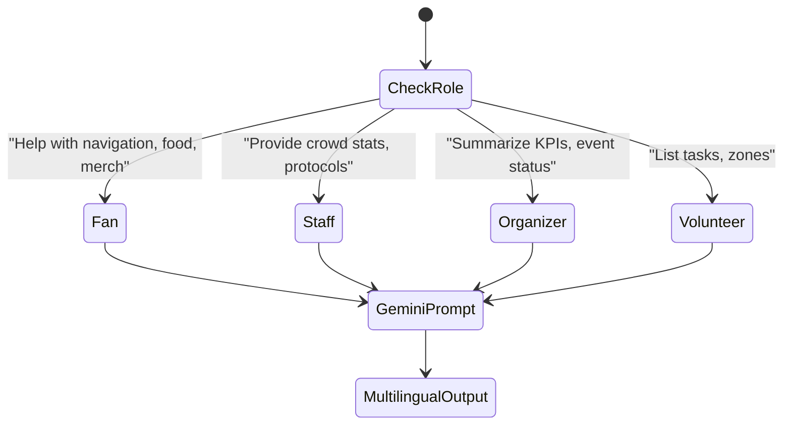

# FanSetu AI 🏟️

**A dynamic, AI-powered stadium operations and fan experience platform for FIFA World Cup 2026.**

Built for Hack2skill "Prompt Wars — Build with AI".

## Overview

FanSetu AI (translating to "Fan Bridge AI") bridges the gap between stadium operations and the fan experience. It provides a real-time simulated environment of MetLife Stadium during a high-stakes match (Brazil vs Argentina), offering tailored views for 4 distinct roles:

1. ⚽ **Fan / Attendee**: Navigation, transport recommendations, and accessibility tools.
2. 👷 **Operations Staff**: Crowd monitoring, incident management, and AI staffing dispatch.
3. 📋 **Organizer**: Executive KPIs, sustainability metrics, and AI match briefings.
4. 🙋 **Volunteer**: Task assignments, quick-action checklists, and shift management.

## System Workflows & Architecture

The application uses **React + Zustand** for the frontend, while a simulated backend (`crowdSimulator.ts`) emits real-time data ticks for crowd density and transit availability. **Google Gemini (1.5 Flash)** is deeply integrated for multilingual support, incident protocols, and context-aware insights.

### 1. Incident Management & AI Protocol Generation
When a staff member reports an incident (e.g., Medical Emergency), the data is sent to the Gemini AI to generate a secure, 4-step actionable protocol.



### 2. Live Crowd Density & Transit Routing
The simulator updates crowd density per zone every few seconds. When a Fan wants to find the best transit option, the `rankTransitOptions` algorithm computes availability scores.

```mermaid
flowchart TD
    A[crowdSimulator.ts] -->|Broadcasts Tick| B(Global App State)
    B --> C{User Role?}
    C -->|Fan| D[Transport Hub / Map]
    C -->|Staff| E[Crowd Heatmap & Deployment]
    D --> F[Ranked Transit Options based on capacity & ETA]
    E --> G[AI Staffing Insights (Reassign idle staff)]
```

### 3. Role-Based AI Assistant
The AI Chatbot dynamically adapts its personality and allowed actions based on the current user's role and selected language.



## Key Features

- **Multilingual AI Assistant**: Powered by Google Gemini. Offers contextual, role-aware chat in 10 languages with voice input capabilities.
- **Smart Navigation & Crowd Heatmaps**: Simulates live crowd density using D3-inspired SVGs. Provides AI-based routing to avoid congestion.
- **Transport Optimization**: Ranks transit options dynamically based on capacity and departure times (FR-5.2 algorithm).
- **Automated Incident Management**: AI analyzes incidents in real-time and generates 4-step actionable emergency protocols.
- **Accessibility First**: WCAG 2.1 AA compliant. Features text-scaling, high-contrast mode, semantic HTML, keyboard navigation, and `aria` landmarks.

## Technology Stack

- **Framework**: React 18 with TypeScript + Vite
- **State Management**: Zustand (Unidirectional flow)
- **Styling**: Vanilla CSS (Custom design system, variables, no heavy frameworks)
- **AI Integration**: Google Gemini API (`@google/generative-ai`)
- **Icons**: Lucide React
- **Testing**: Vitest

## Setup Instructions

1. **Clone the repository**
2. **Install dependencies**: `npm install`
3. **Environment Variables**:
   Copy `.env.example` to `.env` and add your Google Gemini API key:
   ```env
   VITE_GEMINI_API_KEY="your_api_key_here"
   ```
   *(Note: The app will run in "Mock Mode" if no API key is provided, generating simulated offline responses to comply with hackathon offline-grading rules).*
4. **Run the development server**: `npm run dev`
5. **Run tests**: `npm run test`
6. **Deploy to Firebase**:
   ```bash
   npm run build
   firebase deploy --only hosting
   ```

## Architecture & Assumptions

- **Mock Data**: All live crowd, shuttle, and incident data is simulated via `src/services/crowdSimulator.ts` for demonstration purposes. It runs on `setInterval` loops.
- **AI Prompts**: Prompts are sanitized and context-aware based on the user's role and language preference.
- **Hackathon Constraints**: To keep the repository size strictly under 10MB, large dependencies, heavy charting libraries, and high-res media were avoided.

---
*Created by Abdul Rahman for Prompt Wars 2024.*
