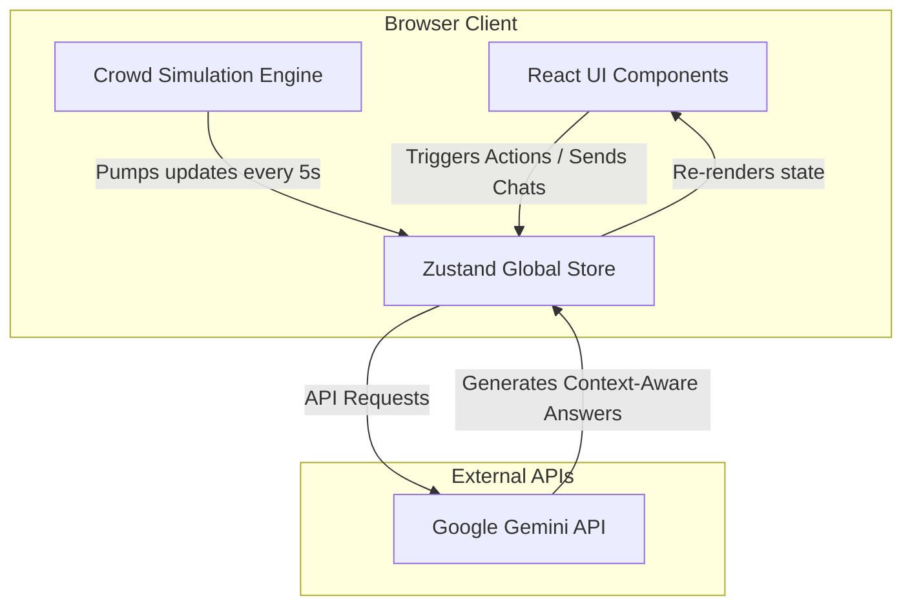
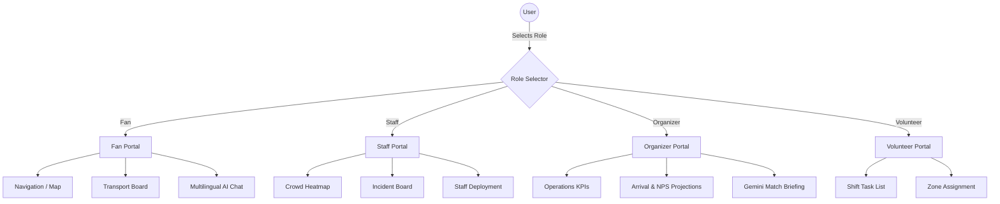
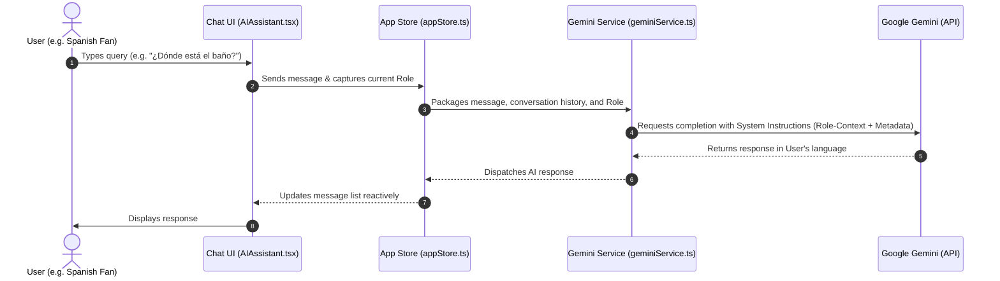

# ⚽ StadiumIQ — GenAI-Enabled Stadium Operations & Fan Experience Platform

StadiumIQ is a premium, reactive, and responsive full-stack web application designed for the **FIFA World Cup 2026**. Built with React, TypeScript, Vite, and CSS, it utilizes the Google Gemini API to streamline venue operations, crowd monitoring, shuttle logistics, and fan assistance at major tournament venues, starting with a live simulation at **MetLife Stadium (New York/New Jersey)**.

The solution provides role-based portals for four primary user groups:
1. **🏟️ Fans**: For seat wayfinding, smart routing, shuttle bookings, and multilingual assistance.
2. **👷 Venue Staff / Stewards**: For reporting incidents, managing queues, and getting AI-generated response protocols.
3. **📋 Tournament Organizers**: For tracking stadium-wide KPIs, viewing crowd predictions, and generating automated executive briefings.
4. **🙋 Volunteers**: For viewing shift schedules, zone assignments, and emergency waypoints.

---

## 🎨 Technology Stack
- **Framework**: React 18, TypeScript, Vite
- **State Management**: Zustand (reactive, global store driving real-time simulated updates)
- **Styling**: Vanilla CSS (custom light-theme design system featuring clean white backgrounds, blue highlights, and soft shadows)
- **AI Core**: Google Gemini Pro (briefings) & Gemini Flash (chat, incident protocols)
- **Visualization**: Recharts (radar, donut, and area charts for operations and sustainability)
- **Icons**: Lucide React

---

## 📐 Architecture & Workflow Diagrams

### 1. Overall System Architecture
The application uses a unidirectional data flow powered by **Zustand** as the reactive state coordinator, which receives continuous updates from the **Crowd Simulation Engine** and queries the **Google Gemini API** asynchronously.



### 2. Role-Based User Portals & View Access


### 3. AI Assistant Translation & Response Pipeline


---

## 📂 Project Structure
```
STADIUMIQ/
├── src/
│   ├── components/
│   │   ├── ai/
│   │   │   └── AIAssistant.tsx         # AI Chat with Web Speech voice recognition
│   │   ├── crowd/
│   │   │   └── CrowdHeatmap.tsx        # Live crowd congestion table
│   │   ├── layout/
│   │   │   ├── RoleSelector.tsx        # Nav header roles (Fan, Staff, etc.)
│   │   │   ├── Sidebar.tsx             # Responsive global navigation
│   │   │   └── TopBar.tsx              # Page headers & alerts indicator
│   │   ├── navigation/
│   │   │   └── StadiumMap.tsx          # Interactive SVG stadium map
│   │   ├── operations/
│   │   │   └── IncidentBoard.tsx       # Incident list & AI Protocol Generator
│   │   ├── sustainability/
│   │   │   └── SustainabilityDashboard.tsx # Environmental metrics & Recharts graphs
│   │   └── transport/
│   │       └── TransportBoard.tsx      # Real-time shuttle board & capacity bars
│   ├── data/
│   │   └── stadiums.ts                 # Stadium configs & coordinates
│   ├── pages/
│   │   ├── AccessibilityPage.tsx       # Accessibility hub & priority queues
│   │   ├── CrowdPage.tsx               # Crowd monitoring hub
│   │   ├── Dashboard.tsx               # Dynamic main landing dashboard
│   │   ├── NavigationPage.tsx          # Indoor route search & quick guides
│   │   ├── OperationsPage.tsx          # Incident board & staff table
│   │   ├── OrganizerPage.tsx           # Organizer metrics & Match Briefing Generator
│   │   ├── SustainabilityPage.tsx      # Green targets wrapper
│   │   ├── TransportPage.tsx           # Transport schedules & exit planner
│   │   └── VolunteerPage.tsx           # Volunteer tasks & protocols
│   ├── services/
│   │   ├── crowdSimulator.ts           # Background thread simulating stadium crowd updates
│   │   └── geminiService.ts            # Connector for Gemini Pro / Flash models
│   ├── store/
│   │   └── appStore.ts                 # Zustand state manager (alerts, incidents, language)
│   ├── types/
│   │   └── index.ts                    # TypeScript types
│   ├── App.tsx                         # Client router & page routes
│   ├── index.css                       # Light-mode design system stylesheet
│   └── main.tsx                        # React bootstrap file
├── index.html
├── package.json
├── tsconfig.json
└── vite.config.ts
```

---

## 🚀 Getting Started

### 1. Prerequisites
- [Node.js](https://nodejs.org/) (v18 or higher)
- NPM (or Yarn / PNPM)
- [GitHub CLI](https://cli.github.com/) (if pushing or cloning)

### 2. Installation
Clone the repository:
```bash
git clone https://github.com/AbdulRahmanGithb/STADIUMIQ.git
cd STADIUMIQ
```

Install dependencies:
```bash
npm install
```

### 3. Setup Environment Variables
Create a `.env` file in the root directory:
```bash
VITE_GEMINI_API_KEY=your_google_gemini_api_key_here
```
> **Note**: If `VITE_GEMINI_API_KEY` is not provided or is invalid, the application runs in a simulated **Mock Mode** using deterministic responses so the UI remains fully functional.

### 4. Running the Development Server
```bash
npm run dev
```
Open [http://localhost:5173](http://localhost:5173) in your browser.

### 5. Production Build
```bash
npm run build
```
This compiles the TypeScript files and exports the minified bundles to the `dist` folder.

---

## 💡 Key Highlights
- **Reactive Data Simulation**: The `crowdSimulator.ts` updates data every 5 seconds, triggering visual changes in the heatmaps and KPI metrics dynamically.
- **Multilingual Support**: Supports 10 languages (English, Spanish, French, Arabic, Portuguese, German, Chinese, Japanese, Hindi, Urdu) with translation built directly into the AI greeting and response chain.
- **Actionable Buttons**: All page elements and quick-action buttons are wired with onClick events to guide users through functional workflows.
